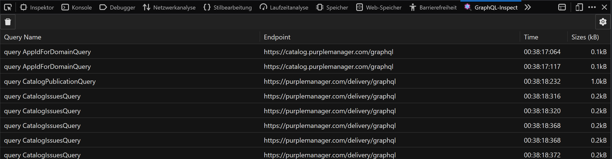
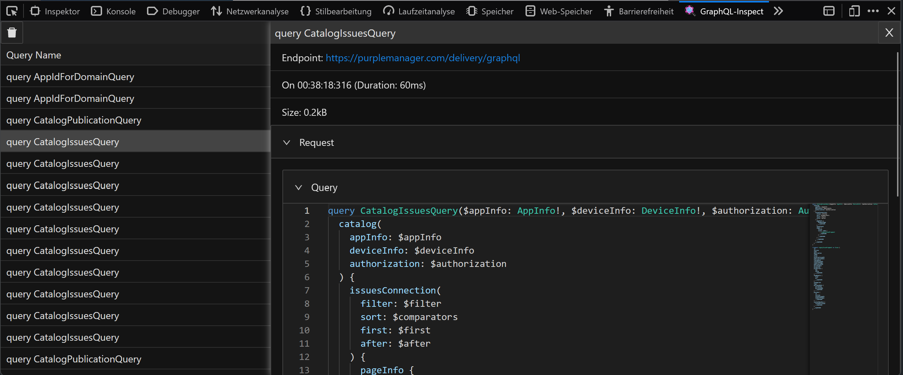

# GraphQL-Inspect

© Matthias Kind 2022

Network request parser from https://github.com/Ghirro/graphql-network 

## Usage

List of queries

Query details

This browser plugin captures GraphQL requests made by the inspected tab and displays the query data and response.

## Develop

### To build UI

`npm run dev`

run `fakeReq()` in console to populate table with fake reqs captured (see fakes.ts)

### To test in browser

`npm run build:firefox`

`npm run start:firefox`, open devtools, open GraphQL-Inspect tab and go to page that uses GraphQL

or sideload the dist/firefox folder in Edge or Chrome